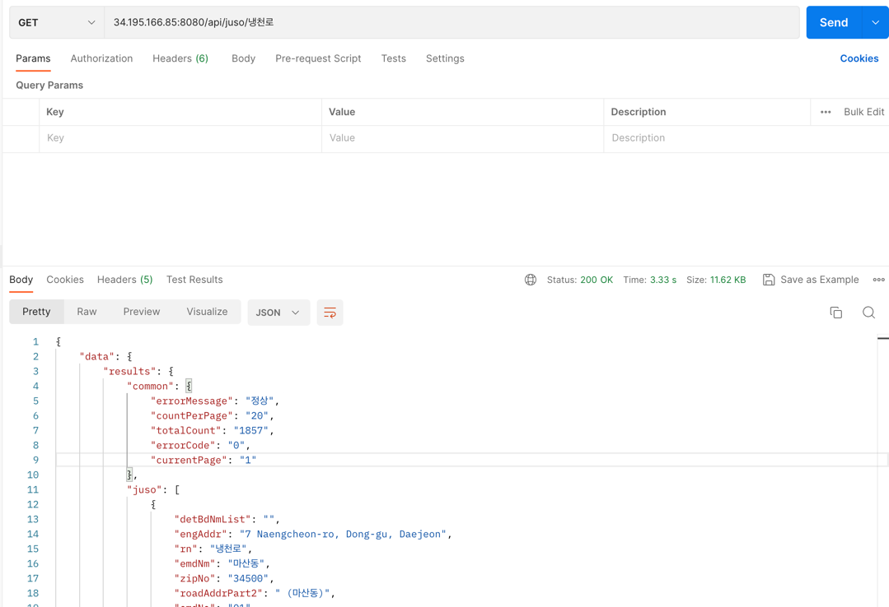

# econrich 과제 김태수 

- spring boot (gradle 2.7.10)
- java 11
- DB : mariaDB 10.5 (docker)
- JPA 
- WebClient
- server : AWS EC2
 
 
 

 

## api info

### 1. 사원 목록 조회

- method : get
- url : 34.195.166.85:8080/api/employee


### 2. 특정사원 현재정보 조회

- method : get
- url : 34.195.166.85:8080/api/employee/{employeeId}
- ex : 34.195.166.85:8080/api/employee/101
- 

### 3. 특정 사원의 이력정보 조회

- method : get 
- url : 34.195.166.85:8080/api/employee/history/{employeeId}
- ex : 34.195.166.85:8080/api/employee/history/101
- 


### 4. 부서목록 조회

- method : get
- url : 34.195.166.85:8080/api/department
- 

### 5. 부서 및 위치정보 조회

- method : get
- url : 34.195.166.85:8080/api/department/location/{departmentId}
- ex : 34.195.166.85:8080/api/department/location/30
- 

### 6. 특정 부서의 급여 특정 비율로 인상

- explain : job 테이블에 최대급여가 있어서 특정 부서의 급여가 올라갈때 자동으로 해당 직책의 최대급여보다 높으면 최대급여도 같이 수정되도록 설정해두었습니다.
- method : put 
- url : 34.195.166.85:8080/api/department/salary/{departmentId}
- ex : 34.195.166.85:8080/api/department/salary/20
- body : 

```aidl
{
    "percent" : 1.4
}
```

- 

### 7. 주소기반 산업지원서비스 API 호출

- info : 도로명 주소 검색 api
- method : get
- url : 34.195.166.85:8080/api/juso/{검색할 주소명}
- ex : 34.195.166.85:8080/api/juso/냉천로
- 